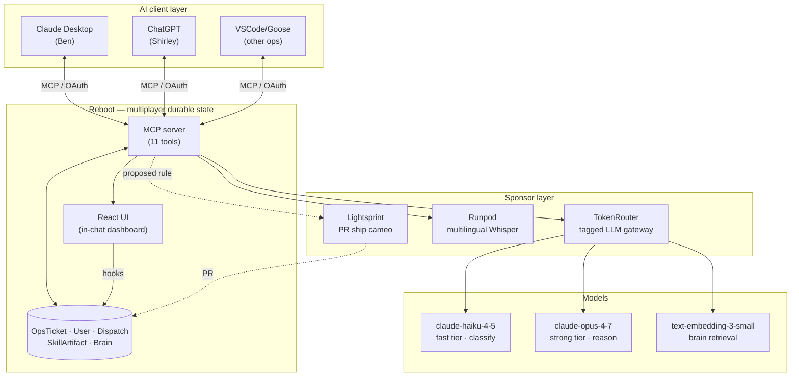
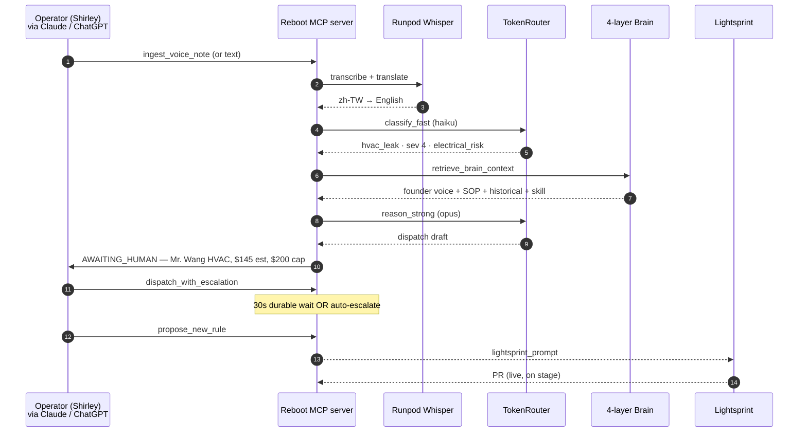

# LoopOS

> **Closed-loop AI operating system for deskless service companies.**
> Every company is an open loop — decisions in Slack, work in tickets, knowledge in heads. LoopOS closes the loop.

Built for **AWS Builder Loft "Build YC's Next Unicorn — Agent Hack Day"**, April 29 2026.

I run five short-term rentals across four countries with a four-person multilingual ops team. We replaced our back office with a Claude agent that does the work. We don't sell PMS software — we *are* the property manager.

---

## Architecture

A multiplayer MCP-native AI Chat App. Every team member's AI assistant (Claude, ChatGPT, Goose, …) plugs into the same durable backend and shares state.



**Three things make it work:**

| | |
|---|---|
| **Multiplayer state** | Reboot's durable workflow + MCP server. Same `OpsTicket` instance visible from any AI client. Beat 5 of the demo: tab-flip from Claude → ChatGPT, same ticket, approve dispatch from either. |
| **Executable Skills** | Resolved patterns get distilled into a `SkillArtifact` (YC #4 *executable skills file*, named by Tom Blomfield). The agent runs against the artifact, not against chat-over-docs. |
| **Per-property unit economics** | Every LLM call routed through TokenRouter with `metadata.{property_id, ticket_id, tier}`. Cost ticker reads `usage.jsonl` server-side — `$0.043 today / $499.96 budget remaining`-style telemetry without any extra service. |

---

## Data flow — one ticket end-to-end



---

## Reboot state model

```
User                              OpsTicket
├── ticket_ids: list[str]         ├── property_id, source, raw_input
└── methods (mcp=Tool):           ├── transcript_native, transcript_en
    ├── ingest_text_message       ├── category, severity, status
    ├── ingest_voice_note         ├── matched_voice_memo_ids
    ├── list_tickets              ├── matched_sop_id
    ├── query_brain               ├── matched_historical_ids
    ├── live_state                ├── skill_artifact: Optional[SkillArtifact]
    ├── cost_summary              ├── dispatches: list[Dispatch]
    └── show_loopos_dashboard     └── methods (mcp=Tool):
                                       ├── triage         (Writer)
                                       ├── dispatch_with_escalation (Workflow, 30s)
                                       ├── acknowledge_dispatch     (Writer)
                                       ├── propose_new_rule         (Writer)
                                       └── show_brain_sources       (Reader)
```

**Status transitions:** `NEW` → `TRIAGED` (auto-authorized below cap) **OR** `AWAITING_HUMAN` (severity ≥ 4 or over cap) → `DISPATCHED` → `RESOLVED`.

---

## The four-layer Company Brain

```
data/
├── voice_corpus.json              ←  founder voice memos (the unfakeable bit)
│                                     "AC at Taipei — always Mr. Wang first.
│                                      Mandarin OK. Around $80 emergency call.
│                                      Don't auth over $200 without warranty check."
├── sops.json                      ←  HVAC Leak & Electrical Safety Protocol
├── historical_resolutions.json    ←  past tickets (recurrence patterns)
├── skills/handle_hvac_leak.json   ←  pre-generated SkillArtifact
└── properties.json + team.json + vendors.json  ←  structured knowledge
```

Retrieval (`backend/src/servicers/helpers/retrieval.py`): cosine over OpenAI embeddings + tag boost (+0.15 property match, +0.10 category match), keyword fallback. SOP match by `id` then `trigger_phrases`. Historical filtered by `(property_id, category)` recency-desc.

---

## Two-tier LLM routing — per-property unit economics

| Tier | Model | Routes | When |
|---|---|---|---|
| **fast** | `claude-haiku-4-5` (`LOOPOS_FAST_MODEL`) | TokenRouter → Anthropic | Ticket classification (category / severity / language / risk_tags) |
| **strong** | `claude-opus-4-7` (`LOOPOS_STRONG_MODEL`) | TokenRouter → Bedrock/Anthropic | Dispatch reasoning, translation, rule proposal |
| **embed** | `text-embedding-3-small` | TokenRouter → OpenAI | Voice memo cosine ranking (cached) |

Every call carries `extra_body.metadata = {property_id, ticket_id, tier}`. TokenRouter's dashboard groups cost per-property; we also append `{ts, model, tier, input_tokens, output_tokens, usd}` to `usage.jsonl` server-side. The dashboard's `User.cost_summary` Reader aggregates that file → React `CostTicker` subscribes via WebSocket. Real cost, not staged.

Pricing (`backend/src/servicers/helpers/llm.py`):
```
fast   $0.0000005 / input, $0.0000015 / output
strong $0.000015  / input, $0.000075  / output
```

---

## Sponsor stack — load-bearing roles

| Sponsor | Role | Beat |
|---|---|---|
| **Reboot** | Durable multiplayer state, MCP server, React UI **inside Claude** | Beat 3 brain reveal · Beat 5 cross-client multiplayer |
| **TokenRouter** | Two-tier OpenAI-compatible router with per-call metadata tagging → real-time per-property cost ticker | Beat 2 cost ticker increment |
| **Runpod** | Faster-whisper serverless for multilingual ingest (zh-TW/ja/id → en); hardcoded fallback dict for stage reliability | Beat 1 voice transcription |
| **Lightsprint** | Closing cameo — paste `lightsprint_prompt` from `propose_new_rule`, ship a PR live against this repo | Beat 6 closed-loop ship |

---

## YC Summer 2026 RFS coverage

| RFS | Author | LoopOS proof | Pitch surface |
|---|---|---|---|
| **#2** AI-native service companies | Gustaf Alströmer | Operator-margin model — I am the property manager. Real revenue, real ops team. | 60s pitch sentence 1 |
| **#4** Company Brain | Tom Blomfield | `SkillArtifact` JSON viewer — the *executable skills file* primitive, rendered live from real triage | 60s pitch sentence 2 + Beat 4 |
| **#15** AI OS for companies | Diana Hu | Closed-loop architecture; every interaction legible; cost ticker queryable | Demo embodies it; Q&A bridge |
| **#12** Software for agents | Aaron Epstein | Every Skill is `agent.json`-compatible | Q&A only — no /agents/ endpoints today |

---

## Run locally

```bash
# 1. Backend (in one terminal — needs envoy on PATH and TokenRouter creds in 1Password)
brew install envoy   # one-time
op run --env-file=.env-loopos -- \
  script -q /dev/null env REBOOT_LOCAL_ENVOY_MODE=executable \
  uv run rbt dev run --config=dist --no-chaos

# 2. UI dev (separate terminal — for HMR while editing React)
cd web && npm run dev

# 3. Connect Claude Desktop
#    ~/Library/Application Support/Claude/claude_desktop_config.json
#    {
#      "mcpServers": {
#        "loopos": {
#          "command": "npx",
#          "args": ["-y", "mcp-remote", "http://localhost:9991/mcp"]
#        }
#      }
#    }
```

Then in Claude Desktop:

```
Use ingest_text_message at warm_taipei_2br from shirley with text:
"Ben，Warm Taipei 主臥冷氣在漏水，水滴到插座旁邊，客人在生氣，要找誰？"
Then open the loopos dashboard.
```

---

## Demo path — three minutes flat

```
0:00  Frame: "every company is an open loop. LoopOS closes the loop."
0:15  Ingest text from Shirley (zh-TW, Mandarin)            ← Runpod/Whisper layer
0:45  Triage runs. Reboot UI renders inside Claude.         ← TokenRouter cost ticker
1:15  "Show Brain Sources." Three cards reveal.             ← four-layer Brain
1:45  SkillArtifact JSON viewer opens.                      ← YC #4 money screenshot
2:15  Tab-flip to ChatGPT. Same ticket. Approve from there. ← Reboot multiplayer
2:40  "Propose New Rule." Click → Lightsprint → PR opens.   ← Lightsprint closed loop
2:55  Close on the SkillArtifact JSON.
```

---

## Repo

```
api/loopos/v1/loopos.py            ← Pydantic API definition (User + OpsTicket types)
backend/src/main.py                 ← Application entrypoint
backend/src/servicers/loopos.py     ← UserServicer + OpsTicketServicer
backend/src/servicers/helpers/
  ├── llm.py                        ← TokenRouter wrapper, usage logging
  ├── whisper.py                    ← Runpod + hardcoded fallback dict
  └── retrieval.py                  ← four-layer Brain
web/ui/loopos-ui/                   ← React UI rendered inside Claude
data/                               ← seed corpus (Brain layers 1–4)
docs/specs/                         ← /spec artifacts (architecture decisions)
docs/runs/                          ← /yolo run reports per task
scripts/smoke.py                    ← end-to-end OAuth + MCP smoke test
.rbtrc                              ← Reboot CLI config
mcp_servers.json                    ← MCP client config template
```
