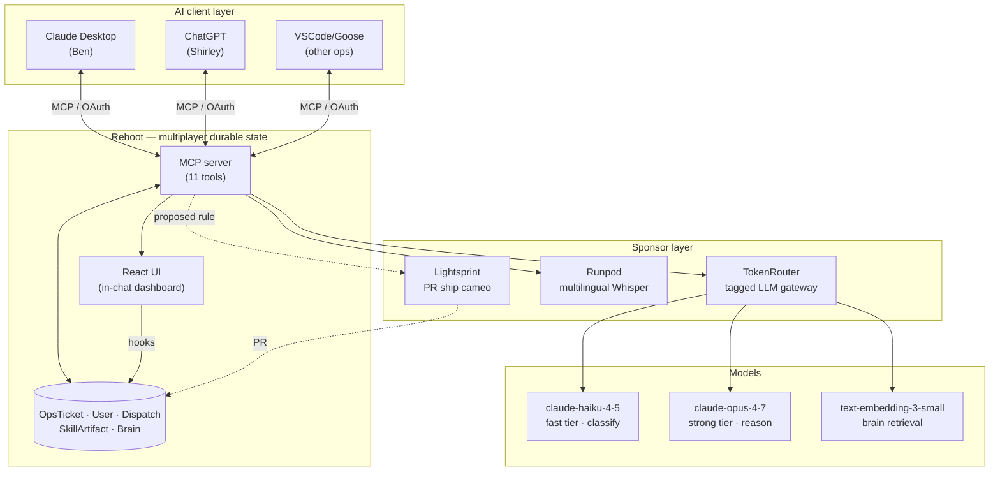
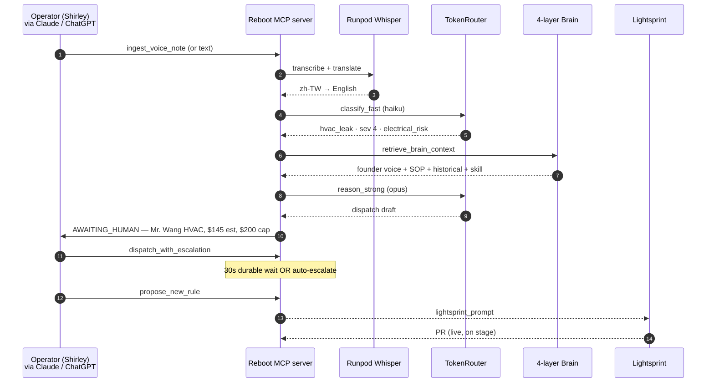

# LoopOS

> **We replaced the back office with an agent.**
> Powered by a Company Brain.

I run five short-term rentals across Japan, Taiwan, Philippines, and Bali with four multilingual assistants on the ground. The agent triages tickets, retrieves the right context from a four-layer Brain, drafts the dispatch, and routes it to the right vendor at the right cost cap. The team uses Claude Desktop, ChatGPT, or any MCP client — all of them plug into the same durable state.

Built for **AWS Builder Loft "Build YC's Next Unicorn — Agent Hack Day"**, April 29 2026.

### The two YC Requests for Startups it answers

> **YC Request for Startups #2 · Alströmer:** *"Sell the service, not the software."*
> Alströmer named insurance, accounting, compliance, healthcare. STR ops is the same shape. Service spend dwarfs software spend. We replaced the back office with an agent. We take the margin.

> **YC Request for Startups #4 · Blomfield:** *"Tribal knowledge in heads, email, Slack, tickets. Agents can't work that way."*
> Blomfield wants a living map. An executable skills file. We built one — four layers, one JSON. The agent runs against it. Not search. Not RAG.

---

## Architecture

A multiplayer MCP-native AI Chat App. Every team member's AI assistant (Claude, ChatGPT, Goose, …) plugs into the same durable backend and shares state.



**What you're looking at:**

| | |
|---|---|
| **Reboot multiplayer durable state** | Same `OpsTicket` instance visible from Claude, ChatGPT, any MCP client. Auto-construct on OAuth identity. Beat 5 of the demo: tab-flip from Claude → ChatGPT, same ticket, approve dispatch from either. |
| **Four-layer Company Brain** | Founder voice memos · SOPs · resolution history · skills registry. Synthesized into JSON the agent runs against. The agent's decisions trace back to all four sources, visible in the dashboard's brain reveal panel. |
| **TokenRouter unit economics** | Every LLM call routed through TokenRouter with `metadata.{property_id, ticket_id, tier}`. Cost ticker reads `usage.jsonl` server-side — real-time per-property $ telemetry. Margin per property, not per month. |

---

## Data flow — one ticket end-to-end



---

## Reboot state model

```
User                              OpsTicket
├── ticket_ids: list[str]         ├── property_id, source, raw_input
└── methods (mcp=Tool):           ├── transcript_native, transcript_en
    ├── ingest_text_message       ├── category, severity, status
    ├── ingest_voice_note         ├── matched_voice_memo_ids
    ├── list_tickets              ├── matched_sop_id
    ├── query_brain               ├── matched_historical_ids
    ├── live_state                ├── skill_artifact: Optional[SkillArtifact]
    ├── cost_summary              ├── dispatches: list[Dispatch]
    └── show_loopos_dashboard     └── methods (mcp=Tool):
                                       ├── triage         (Writer)
                                       ├── dispatch_with_escalation (Workflow, 30s)
                                       ├── acknowledge_dispatch     (Writer)
                                       ├── propose_new_rule         (Writer)
                                       └── show_brain_sources       (Reader)
```

**Status transitions:** `NEW` → `TRIAGED` (auto-authorized below cap) **OR** `AWAITING_HUMAN` (severity ≥ 4 or over cap) → `DISPATCHED` → `RESOLVED`.

---

## The four-layer Company Brain

```
data/
├── voice_corpus.json              ←  founder voice memos (the unfakeable bit)
│                                     "AC at Taipei — always Mr. Wang first.
│                                      Mandarin OK. Around $80 emergency call.
│                                      Don't auth over $200 without warranty check."
├── sops.json                      ←  HVAC Leak & Electrical Safety Protocol
├── historical_resolutions.json    ←  past tickets (recurrence patterns)
├── skills/handle_hvac_leak.json   ←  pre-generated SkillArtifact
└── properties.json + team.json + vendors.json  ←  structured knowledge
```

Retrieval (`backend/src/servicers/helpers/retrieval.py`): cosine over OpenAI embeddings + tag boost (+0.15 property match, +0.10 category match), keyword fallback. SOP match by `id` then `trigger_phrases`. Historical filtered by `(property_id, category)` recency-desc.

---

## Two-tier LLM routing — per-property unit economics

| Tier | Model | Routes | When |
|---|---|---|---|
| **fast** | `claude-haiku-4-5` (`LOOPOS_FAST_MODEL`) | TokenRouter → Anthropic | Ticket classification (category / severity / language / risk_tags) |
| **strong** | `claude-opus-4-7` (`LOOPOS_STRONG_MODEL`) | TokenRouter → Bedrock/Anthropic | Dispatch reasoning, translation, rule proposal |
| **embed** | `text-embedding-3-small` | TokenRouter → OpenAI | Voice memo cosine ranking (cached) |

Every call carries `extra_body.metadata = {property_id, ticket_id, tier}`. TokenRouter's dashboard groups cost per-property; we also append `{ts, model, tier, input_tokens, output_tokens, usd}` to `usage.jsonl` server-side. The dashboard's `User.cost_summary` Reader aggregates that file → React `CostTicker` subscribes via WebSocket. Real cost, not staged.

Pricing (`backend/src/servicers/helpers/llm.py`):
```
fast   $0.0000005 / input, $0.0000015 / output
strong $0.000015  / input, $0.000075  / output
```

---

## How TokenRouter + Reboot work in detail

### TokenRouter — the model gateway

OpenAI-compatible. We use the OpenAI Python SDK with `base_url` swapped to TokenRouter:

```python
client = OpenAI(api_key=os.environ["TOKENROUTER_API_KEY"],
                base_url=os.environ["TOKENROUTER_BASE_URL"])
```

Three call sites in `backend/src/servicers/helpers/llm.py`:

**`classify_fast(text, property_id, ticket_id)`** — `claude-haiku-4-5`, JSON-mode response. Sends a system prompt + ticket text; gets back `{category, severity, language, urgency_window_minutes, risk_tags}`. Tagged with `extra_body.metadata = {property_id, ticket_id, tier: "fast"}`. ~150 input / 60 output tokens, ~$0.0003.

**`reason_strong(prompt, property_id, ticket_id)`** — `claude-opus-4-7`, free-form. Two consumers:
- *Translation* (when `transcript_native` is non-English) → returns English text
- *Dispatch drafting* → returns JSON `{vendor_id, cost_estimate_usd, eta_minutes, notes_for_vendor, notes_for_guest}`

~1100 input / 350 output, ~$0.04.

**`embed(text)`** — `text-embedding-3-small`, used by retrieval helper for voice memo cosine ranking. Cached in `embeddings_cache.pkl`.

**What TokenRouter buys us:**
- One client, one API key, one endpoint for haiku + opus + embeddings
- Per-call `metadata.property_id` tagging → TR's dashboard groups cost per property
- Local `usage.jsonl` parallel log so the dashboard's `User.cost_summary` Reader can compute per-property $ without hitting TR's API at render time
- Cost ticker reads `usage.jsonl`, not TR's dashboard — works even if TR is slow on stage

### Reboot — durable workflow + MCP + React-in-Claude

**1. State model.** `User` and `OpsTicket` are durable types, rocksdb-backed at `.rbt/dev/loopos/p000000`. Survives restarts.

```python
class UserState(Model):
    ticket_ids: list[str]                # one User per OAuth identity

class OpsTicketState(Model):
    property_id, severity, status, ...   # 19 fields
    skill_artifact: Optional[SkillArtifact]
    history: list[HistoryEvent]          # the activity feed lives here
    dispatches: list[Dispatch]
```

`User` has `_is_auto_construct = True` — Reboot auto-creates the User instance when a new OAuth user_id arrives. No application-level "create user" code.

**2. Method types we use.**

| Type | Where | What |
|---|---|---|
| **Writer** | `OpsTicket.triage`, `acknowledge_dispatch`, `propose_new_rule`, `create` (factory) | Atomic single-state mutation. `triage` chains classify → retrieve → reason inside one writer call. |
| **Transaction** | `User.ingest_text_message`, `ingest_voice_note` | Multi-state atomic: create OpsTicket factory + append ID to User.ticket_ids + await triage. |
| **Reader** | `User.list_tickets/live_state/query_brain/cost_summary`, `OpsTicket.show_brain_sources/activity_feed` | Read-only. Subscribed via WebSocket from React. Auto-rerender on state change. |
| **Workflow** | `OpsTicket.dispatch_with_escalation` | Durable async with timer. (Currently stub; production: 30s wait for ack or auto-escalate.) |
| **UI** | `User.show_loopos_dashboard` | Opens the React app **inside Claude's chat iframe**. Reboot serves the dist bundle via Envoy. |

**3. MCP server — auto-generated from decorators.**

```python
methods=Methods(
    triage=Writer(..., mcp=Tool()),    # ← that's the entire MCP wiring
)
```

The `mcp=Tool()` decorator on each method exposes it as an MCP tool. We have 12 tools without writing any MCP plumbing. Claude Desktop and ChatGPT both speak MCP over HTTP — they hit the same Reboot instance, see the same `OpsTicket(state_id)`. **That's Beat 5 multiplayer.**

OAuth in dev: Reboot auto-runs `Anonymous(_is_dev_default=True)`. Each fresh MCP session gets an `anon-{ULID}` user_id, JWT-signed bearer token, auto-constructed User instance.

**4. React inside Claude — `ui` method + `RebootClientProvider`.**

```tsx
<RebootClientProvider>
  <ErrorBoundary><LoopOsApp /></ErrorBoundary>
</RebootClientProvider>
```

`RebootClientProvider` auto-detects iframe context, picks up the bearer token, wires WebSocket to backend at `localhost:9991`. Generated React hooks per state type:

```tsx
const ticket = useOpsTicket({ id: ticketId });
const { response } = ticket.useShowBrainSources();   // WebSocket subscription
await ticket.proposeNewRule();                        // mutation
```

The hooks subscribe to state changes and trigger re-renders automatically. No manual WebSocket code.

**5. Envoy.** Reboot uses Envoy as a proxy. We installed it via `brew install envoy` and set `REBOOT_LOCAL_ENVOY_MODE=executable`. Envoy routes:
- `/__/web/**` → static dist files (prod) or Vite (dev)
- `/mcp` → MCP server
- gRPC traffic → backend servicer

### What this stack replaces

If we built this without Reboot/TokenRouter, the equivalent would be:

```
FastAPI + Pydantic              →  Reboot Models + auto-API
Custom OAuth + JWT              →  Anonymous(_is_dev_default=True)
WebSocket + state diffing       →  useUser/useOpsTicket hooks
Postgres + migrations           →  durable Reboot state, no schema code
MCP server library + manual     →  mcp=Tool() decorator, auto-exposure
  tool exposure
Anthropic SDK + OpenAI SDK      →  one OpenAI SDK pointed at TR
  + cost log per call              + extra_body.metadata + usage.jsonl
2-tier router logic             →  tier="fast" / "strong" args
Envoy / nginx routing           →  bundled with `rbt dev run`
```

Two libraries doing what would otherwise be six services + ~2000 lines of glue.

---

## Sponsor stack — what's actually invoked

Honest attribution: only sponsors whose code path actually fires during
the demo carry a load-bearing claim. Sponsors marked *off-stage* exist
in the codebase but require a different demo path to activate.

| Sponsor | Role | Status in current demo |
|---|---|---|
| **Reboot** | Durable multiplayer state, MCP server, React UI **inside Claude**; auto-construct of User per OAuth identity | ✅ load-bearing — every tool call goes through it |
| **TokenRouter** | Two-tier OpenAI-compatible router with per-call metadata tagging → real-time per-property cost ticker (claude-haiku-4-5 fast tier, claude-opus-4-7 strong tier) | ✅ load-bearing — Beat 2 cost ticker shows real $ |
| **Runpod** | Faster-whisper serverless for multilingual voice ingest (zh-TW/ja/id → en) with hardcoded fallback dict | ⚠ off-stage in text-only demo — only fires via `ingest_voice_note`. Wire by recording an audio file and ingesting it. |
| **Lightsprint** | Closing cameo — paste `lightsprint_prompt` from `propose_new_rule`, ship a PR live against this repo | ⚠ off-stage by default — `propose_new_rule` generates the prompt via **Reboot**; Lightsprint only runs after manual paste into Lightsprint's sandbox |

---

## YC Summer 2026 Requests for Startups

### #2 · Gustaf Alströmer — *"Sell the service, not the software."*

> The era of AI copilots is ending. The next era is companies that skip the human entirely and just do the work. Total spend on services is many times larger than spend on software. Categories YC named: insurance brokerage, accounting/tax/audit, compliance, healthcare administration.

LoopOS proof: I run nine STR properties across four countries. Real revenue, real ops team (Miguel, Shirley, Haru, Celine). The agent does the back-office work. We take the operator margin. STR ops isn't on YC's named list — same shape, untapped.

### #4 · Tom Blomfield — *"Knowledge in heads, email, Slack, tickets. Agents can't work that way."*

> The biggest blocker to AI automation isn't model quality. It's domain knowledge. Tom wants a system that pulls knowledge out of every fragmented source, structures it, keeps it current, and turns it into an executable skills file for AI. Not a search tool. Not a chatbot over documents. A living map of how a company actually works.

LoopOS proof: the four-layer Brain renders live in the dashboard. `data/voice_corpus.json` (founder voice memos) + `data/sops.json` (SOPs) + `data/historical_resolutions.json` (resolution history) + `data/skills/` (skills registry). On Beat 4 the `SkillArtifact` JSON viewer shows the executable Skill the agent runs against — Blomfield's exact primitive.

### Q&A bridges (not in 60s pitch)

| RFS | Author | If they ask "what about…" |
|---|---|---|
| **#15** AI OS for companies | Diana Hu | Every interaction is a durable, queryable Reboot state. The cost ticker is a live `Reader` over `usage.jsonl`. Closed loop: every resolved ticket sharpens the Brain. |
| **#12** Software for agents | Aaron Epstein | Every Skill is `agent.json`-compatible — same JSON shape. We're not building `/agents/` endpoints today, but the artifact ports unchanged. |

---

## Run locally

```bash
# 1. Backend (in one terminal — needs envoy on PATH and TokenRouter creds in 1Password)
brew install envoy   # one-time
op run --env-file=.env-loopos -- \
  script -q /dev/null env REBOOT_LOCAL_ENVOY_MODE=executable \
  uv run rbt dev run --config=dist --no-chaos

# 2. UI dev (separate terminal — for HMR while editing React)
cd web && npm run dev

# 3. Connect Claude Desktop
#    ~/Library/Application Support/Claude/claude_desktop_config.json
#    {
#      "mcpServers": {
#        "loopos": {
#          "command": "npx",
#          "args": ["-y", "mcp-remote", "http://localhost:9991/mcp"]
#        }
#      }
#    }
```

Then in Claude Desktop:

```
Use ingest_text_message at warm_taipei_2br from shirley with text:
"Ben，Warm Taipei 主臥冷氣在漏水，水滴到插座旁邊，客人在生氣，要找誰？"
Then open the loopos dashboard.
```

---

## Demo path — three minutes flat

```
0:00  Frame: "every company is an open loop. LoopOS closes the loop."
0:15  Ingest text from Shirley (zh-TW, Mandarin)            ← Runpod/Whisper layer
0:45  Triage runs. Reboot UI renders inside Claude.         ← TokenRouter cost ticker
1:15  "Show Brain Sources." Three cards reveal.             ← four-layer Brain
1:45  SkillArtifact JSON viewer opens.                      ← YC #4 money screenshot
2:15  Tab-flip to ChatGPT. Same ticket. Approve from there. ← Reboot multiplayer
2:40  "Propose New Rule." Click → Lightsprint → PR opens.   ← Lightsprint closed loop
2:55  Close on the SkillArtifact JSON.
```

---

## Repo

```
api/loopos/v1/loopos.py            ← Pydantic API definition (User + OpsTicket types)
backend/src/main.py                 ← Application entrypoint
backend/src/servicers/loopos.py     ← UserServicer + OpsTicketServicer
backend/src/servicers/helpers/
  ├── llm.py                        ← TokenRouter wrapper, usage logging
  ├── whisper.py                    ← Runpod + hardcoded fallback dict
  └── retrieval.py                  ← four-layer Brain
web/ui/loopos-ui/                   ← React UI rendered inside Claude
data/                               ← seed corpus (Brain layers 1–4)
docs/specs/                         ← /spec artifacts (architecture decisions)
docs/runs/                          ← /yolo run reports per task
scripts/smoke.py                    ← end-to-end OAuth + MCP smoke test
.rbtrc                              ← Reboot CLI config
mcp_servers.json                    ← MCP client config template
```
